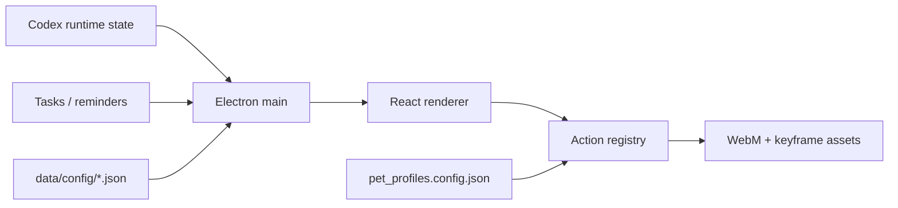

# Architecture

更新时间：2026-05-29

## 当前架构

核心链路：

- Electron main 负责本地窗口、IPC、任务、提醒、runtime state。
- React renderer 负责 companion UI、控制中心、状态面板和动作播放。
- `data/config/action_registry.config.json` 是默认 profile 的动作入口。
- `data/config/pet_profiles.config.json` 决定 profile 切换和每套配置位置。
- `scripts/*` 提供资产校验、motion progress、视频处理和运行时 contract check。

## 关键目录

- `app/electron/`：Electron main、preload、macOS 输入、任务、提醒。
- `app/renderer/`：React UI、companion、控制中心和样式。
- `app/shared/`：共享类型。
- `data/config/`：默认 profile 和全局配置。
- `data/profiles/guofeng_ai/`：古风 AI profile 配置。
- `assets/actions/`：默认真人桌宠动作资产。
- `assets/profiles/guofeng_ai/actions/`：古风 AI 角色动作资产。
- `docs/`：产品、架构、验收、进度和生成进度表。
- `scripts/`：资产、registry、profile 和 runtime 检查脚本。
- `skills/white-bg-video-matting/`：白底视频转透明 WebM 的本地工作流。

## V1.0.0 架构边界

冻结：

- 当前 registry/config 作为运行时权威来源。
- 当前 source video、WebM、keyframe 保留。
- 当前 profile 配置方式保留。
- 当前 Electron 单应用结构保留。

可演进：

- 新增 AI/Agent protocol 层。
- 新增 MCP server/client helper。
- 新增 Integrations 控制中心板块。
- 新增 profile package manifest。

不建议短期改动：

- 过早拆 monorepo。
- 开放任意 JS 插件。
- 为兼容外部宠物包牺牲当前 WebM + keyframe + QA 管线。
- 让 agent 直接写内部 runtime/config 文件。

## V1.1.0 目标架构

```mermaid
flowchart LR
  Agent["Codex / MCP agent / future clients"] --> Client["Companion client"]
  Client --> Discovery["Local discovery + token"]
  Discovery --> Protocol["Companion IPC protocol"]
  Protocol --> Validator["Message validator + cooldown"]
  Validator --> Main["Electron main"]
  Main --> Renderer["React renderer"]
  Renderer --> ActionMap["Reaction -> action id"]
  ActionMap --> Registry["Action registry"]
  Registry --> Assets["Profile assets"]
```

协议层原则：

- 外部 agent 只接触公开 companion methods。
- 内部仍映射到现有 action registry。
- `say` 必须经过安全消息校验。
- `react` 只能触发允许的 action/reaction。
- `status` 可以暴露 readiness，但不泄露本地敏感路径。

## 数据与配置权威源

- 动作是否存在：`action_registry.config.json`
- 动作进度和 source path：`motion_catalog.config.json` + `motion_sources.config.json`
- 运行时状态与时长：`states.config.json`
- profile 列表与路径：`pet_profiles.config.json`
- 用户交互规则：`interaction_rules.config.json`
- plugin 开关：`plugins.config.json`

## 分发与开源预留

技术上要逐步做到：

- 配置 schema 可校验。
- profile package 可独立声明 license、provenance、required actions 和 QA summary。
- macOS 权限、通知、辅助功能、文件访问、网络访问可枚举。
- 核心协议和素材包解耦，便于未来开源核心、闭源或独立授权素材。
