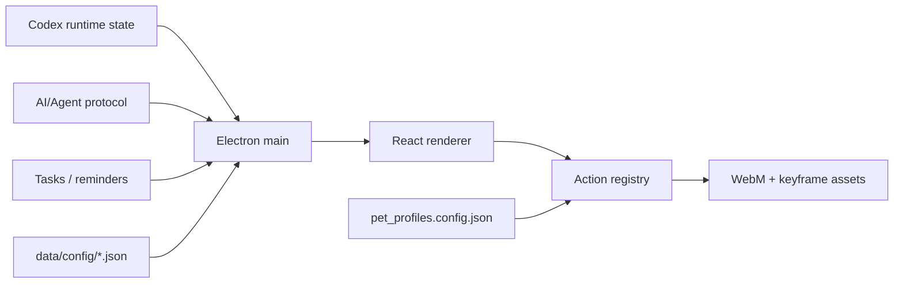

# Architecture

更新时间：2026-05-29

## 当前架构

核心链路：

- Electron main 负责本地窗口、IPC、任务、提醒、Codex runtime state 和 AI/Agent protocol。
- React renderer 负责 companion UI、控制中心、状态面板和动作播放。
- `data/config/action_registry.config.json` 是默认 profile 的动作入口。
- `data/config/pet_profiles.config.json` 决定 profile 切换和每套配置位置。
- `scripts/*` 提供资产校验、motion progress、视频处理和运行时 contract check。

## 关键目录

- `app/electron/`：Electron main、preload、macOS 输入、任务、提醒。
- `app/renderer/`：React UI、companion、控制中心和样式。
- `app/shared/`：共享类型。
- `data/config/`：默认 profile 和全局配置。
- `data/profiles/guofeng_ai/`：古风 AI profile 配置。
- `assets/actions/`：默认真人桌宠动作资产。
- `assets/profiles/guofeng_ai/actions/`：古风 AI 角色动作资产。
- `docs/`：产品、架构、验收、进度和生成进度表。
- `scripts/`：资产、registry、profile 和 runtime 检查脚本。
- `skills/white-bg-video-matting/`：白底视频转透明 WebM 的本地工作流。

## V1.0.0 架构边界

冻结：

- 当前 registry/config 作为运行时权威来源。
- 当前 source video、WebM、keyframe 保留。
- 当前 profile 配置方式保留。
- 当前 Electron 单应用结构保留。

可演进：

- 新增 AI/Agent protocol 层。
- 新增 MCP server/client helper。
- 新增 Integrations 控制中心板块。
- 新增 profile package manifest。

不建议短期改动：

- 过早拆 monorepo。
- 开放任意 JS 插件。
- 为兼容外部宠物包牺牲当前 WebM + keyframe + QA 管线。
- 让 agent 直接写内部 runtime/config 文件。

## V1.1.0 架构

```mermaid
flowchart LR
  Agent["MCP agent / future clients"] --> MCP["stdio MCP adapter"]
  MCP --> Discovery["Local discovery + token"]
  Discovery --> Protocol["Unix socket NDJSON protocol"]
  Protocol --> Validator["Message validator + cooldown"]
  Validator --> Main["Electron main"]
  Main --> Renderer["React renderer"]
  Renderer --> ActionMap["Reaction -> action id"]
  ActionMap --> Registry["Action registry"]
  Registry --> Assets["Profile assets"]
```

协议层原则：

- 外部 agent 只接触公开 companion methods。
- 内部仍映射到现有 action registry。
- `say` 必须经过安全消息校验。
- `react` 只能触发允许的 action/reaction。
- `status` 可以暴露 readiness，但不泄露本地敏感路径。
- 控制中心只显示协议状态，不显示启动 token。

## V1.1.4 MCP 能力蓝图

`V1.1.4` 不改变架构实现，只补充后续能力分层：

- L1：当前已实现的 `status / react / say / profile.list / profile.select`。
- L2：agent 状态面板，将外部 agent 的工作、等待、阻塞、测试和完成状态映射到桌宠。
- L3：用户确认流，把授权、选择和确认请求变成可解释的本地交互。
- L4：事件订阅与上下文摘要，让 agent 少轮询、少直出日志。
- L5：companion kernel，包括 profile 能力、插件能力、权限和用户偏好。

详细边界见 `docs/09_mcp_capability_blueprint.md`。

## V1.1.5 Agent 状态面板

`V1.1.5` 在现有 protocol 层向后兼容增加 L2 agent state methods：

- `companion.agent.set_state`
- `companion.agent.get_state`
- `companion.agent.clear_state`

这些方法仍走本地 discovery、token、Unix socket 和 stdio MCP adapter，不新增远程服务。Renderer 继续复用 `AgentRenderState` 优先级层，控制中心通过 protocol status 观察当前 semantic status、runtime state 和 expiresAt。

## V1.1.6 用户确认流

`V1.1.6` 在 protocol 层新增 L3 confirmation methods：

- `companion.confirm.request`
- `companion.confirm.get`
- `companion.confirm.cancel`

确认请求仍使用本地 Unix socket + token + stdio MCP adapter。Electron main 只维护一个 pending confirmation，并通过 renderer IPC 接收用户的 `allow / deny / cancel` 响应；MCP 不提供用户响应入口，避免外部 agent 伪造授权。pending 时桌宠进入 `waiting_auth`，控制中心自动打开 `AI 接入` 面板展示确认卡片。

控制中心确认卡片是当前缺少专门确认动作和气泡交互时的临时 UI 承接层。后续动作素材和气泡确认组件补齐后，确认流的主入口应迁移到桌宠气泡，控制中心保留为状态观察和兜底入口。

## V1.1.7 上下文摘要与活动记录

`V1.1.7` 在 protocol 层新增 L4 最小只读 methods：

- `companion.context.summary`
- `companion.activity.list`

`context.summary` 返回安全摘要，只包含 app/profile readiness、agent state、confirmation summary、Codex state 摘要、methods 和视频阻塞摘要，不暴露 token、socket path、discovery path、绝对路径或长日志。`activity.list` 从 Electron main 的内存 ring buffer 读取最近活动，默认 20 条、最大 50 条，不落盘、不跨重启保留。

`companion.events.subscribe` 尚未实现；当前 L4 只有只读 summary/list，不提供 streaming event transport。

## V1.1.8 Profile 能力声明

`V1.1.8` 在 profile 配置层新增 `profileManifestPath`，并通过 local protocol 暴露：

- `companion.profile.capabilities`

manifest 由 `data/profiles/<profile>/profile_manifest.config.json` 维护，记录 profile stage、MCP 层级、ready interactions、missing source actions、video blocked actions、确认入口和分发/开源预留字段。`context.summary` 只返回精简 `profileCapabilitiesSummary`，完整能力需要单独调用 profile capabilities。返回内容只包含 action id 和相对文档引用，不暴露 token、socket path、discovery path、绝对路径或本地 cwd。

## 数据与配置权威源

- 动作是否存在：`action_registry.config.json`
- 动作进度和 source path：`motion_catalog.config.json` + `motion_sources.config.json`
- 人工视频供给台账：`docs/10_video_supply_progress.md`
- 运行时状态与时长：`states.config.json`
- profile 列表与路径：`pet_profiles.config.json`
- profile 能力声明：`profile_manifest.config.json`
- 用户交互规则：`interaction_rules.config.json`
- plugin 开关：`plugins.config.json`

## 分发与开源预留

技术上要逐步做到：

- 配置 schema 可校验。
- profile package 可独立声明 license、provenance、required actions 和 QA summary。
- macOS 权限、通知、辅助功能、文件访问、网络访问可枚举。
- 核心协议和素材包解耦，便于未来开源核心、闭源或独立授权素材。
